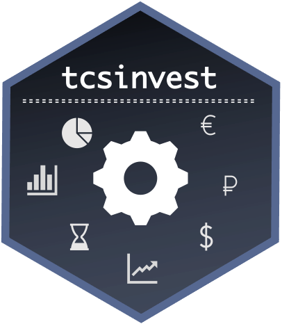

<!-- README.md is generated from README.Rmd. Please edit that file -->

```{r, include = FALSE}
knitr::opts_chunk$set(
  collapse = TRUE,
  comment = "#>",
  fig.path = "man/figures/README-",
  out.width = "100%"
)
options(tibble.print_min = 5, tibble.print_max = 5)
```

# tcsinvest <a href='https://tcsinvest.ru'></a>

<!-- badges: start -->
<!-- badges: end -->


tcsinvest - это неофициальная библиотека R для работы с API Тинькофф Инвестиции. Библиотека дает доступ к функциональности API привычными функциями. Библиотека использует в своей основе библиотеку `data.table` как один из наиболее производительных способов работы с большими объемами информации в R.

* `getStocks()` adds new variables that are functions of existing variables
* `getETFs()` picks variables based on their names.
* `filter()` picks cases based on their values.
* `summarise()` reduces multiple values down to a single summary.
* `arrange()` changes the ordering of the rows.

## Установка библиотеки tcsinvest

Для использования библиотеки в R, ее нужно сперва установить. Можно это сделать 2 способами:

* Использовать версию загруженную в репозиторий CRAN

* Использовать версию с Github

В репозиторий CRAN обычно загружены наиболее стабильные версии библиотек, их легко установить, но достаточно часто они не учитывают последние изменения в коде,  исправления возникающих ошибок и изменения в самом API. Хотя для большинства пользователей достаточно и рекомендуется использование библиотеки загруженной на CRAN. Для установки с CRAN достаточно найти библиотеку в списке общих пакетов или установить с использованием команды:
```{r eval = FALSE}
install.packages("tcsinvest")
```

В случае загрузки библиотеки с github необходима установленная библиотека `devtools` (в случае если ее нет - нужно установить).
```{r eval = FALSE}
devtools::install_github("arbuzovv/tcsinvest",build_vignettes = TRUE)
```
Иногда при таком методе возникает ошибка *"Error in utils::download.file(url, path...."* которая лечится следующей строчкой кода:
```{r eval = FALSE}
options(download.file.method = "libcurl")
```
Если в процессе установки возникает ошибка *"Error in strptime(xx, f, tz = tz) : (converted from warning) unable to identify current timezone"*, то ее можно устранить указанием временной зоны
```{r eval = FALSE}
Sys.timezone()
Sys.setenv(TZ='GMT')
Sys.timezone()
```


## Пример простейшего торгового робота
```{r eval = FALSE}
# задаем баланс в песочнице на который будем торговать
token = 'your_sandbox_token_from_tcs_account'
live = FALSE
sandboxBalance(token,balance = 100000,currency = 'RUB')
getBalance(token,live)

# информация об инструменте
capital = 100000
ticker_info = getTickerInfo(token,live,ticker = 'SBER' )
lots = ticker_info$lot
figi_code = ticker_info$figi

# бесконечный цикл торговли
while(2==2)
{
# инфомация о сигнале и необходимой позиции (теоретической)
history = getHistoricalData(token,live,figi_code,from = Sys.Date()-1,interval = '1min')
last_ret = tail(history$c/history$o-1,1)
size = floor(capital/getQuotes(token,live,figi_code)$lastPrice/lots)
theor_position = ifelse(last_ret>0,size,0)
  
# фактическое состояние портфеля
my_portfolio = getPortfolio(token,live)
if(length(my_portfolio)>0)
  current_position = my_portfolio[figi==figi_code]$lots
current_position = ifelse(length(current_position)==0,0,current_position)  

# приводим теоретическое состояние к фактическому
if(theor_position!=current_position)
{
  direction = ifelse(theor_position-current_position>0,'Buy','Sell')
  marketOrder(token,live,figi_code,direction=direction,lots=abs(theor_position-current_position))
}

# печать совершенных сделок и ожидание следующей минуты  
print(getTrades(token,live))
Sys.sleep(60)
}
```

