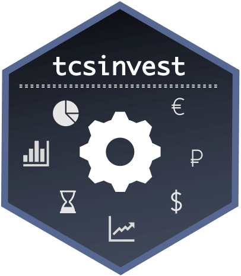

<!-- README.md is generated from README.Rmd. Please edit that file -->

# tcsinvest <a href='https://tcsinvest.ru'></a>

<!-- badges: start -->

[](https://github.com/arbuzovv/tcsinvest/actions/workflows/r.yml)
<!-- badges: end -->

**tcsinvest** - это неофициальная библиотека R для работы с API Тинькофф
Инвестиции. Библиотека использует в своей основе `data.table` как один
из наиболее производительных способов работы с большими объемами данных
в R. Взаимодействией с Rest API реализовано с использованием библиотеки
`httr`, а стриминг данных через `websocket`. Официальная документация
API Тинькофф Инвестиции доступна:
<https://github.com/TinkoffCreditSystems/invest-openapi>

## Установка библиотеки tcsinvest

Для установки с CRAN достаточно найти библиотеку в списке общих пакетов
или установить с использованием команды:

``` r
install.packages("tcsinvest")
```

Второй метод - это установка с Github, для этого необходима
установленная библиотека `devtools`.

``` r
devtools::install_github("arbuzovv/tcsinvest")
```

**Возможные ошибки** возникающие в процессе установки:

При установке с Github иногда может возникать ошибка *“Error in
utils::download.file(url, path….”* которая лечится следующей строчкой
кода:

``` r
options(download.file.method = "libcurl")
```

Если в процессе установки возникает ошибка *“Error in strptime(xx, f, tz
= tz) : (converted from warning) unable to identify current timezone”*,
то ее можно устранить указанием временной зоны

``` r
Sys.timezone()
Sys.setenv(TZ='GMT')
Sys.timezone()
```

Для **подключения** библиотеки к пространству имен:

``` r
library(tcsinvest)
```

## Получение токена

Личный кабинет <http://tinkoff.ru/invest/settings/> -> раздел *“Token
для Open API”* -> для песочницы и для торговли

## Получение списка доступных инструментов

Запомним токен в нашем пространстве имен как `token` и помимо этого
создадим объект `live`, который будет указывать на то, работаем ли мы в
песочнице или торгуем на реальном счету. По умолчанию во всех функциях
для параметра `live` установлено значение `FALSE`.

``` r
token = 'my_token'
live = FALSE
```

Попробуем вызвать список доступных акций:

``` r
getStocks(token,live)
```

Список доступных ETF:

``` r
getETFs(token,live)
```

Список доступных валют:

``` r
getCurrencies(token,live)
```

Список доступных облигаций:

``` r
getBonds(token,live)
```

При каждом вызове функции происходит 1 запрос. Необходимо помнить, что
любое API имеет ограничение по списку запросов в промежуток времени. Для
каждого запроса имеются свои ограничение пропускной способности.

|    Функции    | Количество запросов для пользователя | Количество запросов на IP | Интервал ограничения |
|:-------------:|:------------------------------------:|:-------------------------:|:--------------------:|
|   sandbox^    |                 120                  |           1000            |       1 минута       |
| getPortfolio  |                 120                  |           1000            |       1 минута       |
| market info\* |                 240                  |            500            |       1 минута       |
|   orders ^^   |                 120                  |           1000            |       1 минута       |
| getOperations |                 120                  |           1000            |       1 минута       |

^sandbox - `sandboxRegister`, `sandboxDeleteAccount`, `sandboxBalance`,
`sandboxPositions`, `sandboxDeletePositions`

\*market info -
`getStocks`,`getETFs`,`getCurrencies`,`getBonds`,`getSymbolInfo`,`getTickerInfo`,`getQuotes`,
`getHistoricalData`,`getOrderBook`

^^orders - `marketOrder`,`limitOrder`,`cancelOrder`,`getOrders`

Крайне не рекомендуется пытаться проверять какое количество запросов на
практике проходит до бана.

Иногда на практике необходимо выгрузить все доступные инструменты для
торговли (в алготрейдинге это называют universe). Для этого была
написана функция, которая позволяется выполнить все 4 запроса одной
командой:

``` r
universe = getUniverse(token,live)
```

Каждый вызов данной функции будет генерировать 4 запроса к серверу,
поэтому рекомендуем не злоупотреблять количеством вызовов этой функции и
просто сохранить ее в какую-либо переменную.

Данные функции возвращают объект `data.table` со следующим списком
полей:

-   `figi` - FIGI (англ.: Financial Instrument Global Identifier) —
    глобальный идентификатор финансового инструмента. Представляет собой
    12-символьный код из латинских букв и цифр, определяется как
    идентификатор ценной бумаги на торговой площадке (бирже), которая
    является некоторым “источником цен”. Основным идентификаторов
    торгового инструмента при работе с OpenAPI является FIGI.

-   `ticker` - краткое (1-5 букв) наименование ценной бумаге на
    конкретной бирже.

-   `isin` - ISIN (англ.: International Security Identification Number)
    — международный идентификационный номер ценной бумаги, состоит из 12
    символов цифр и латинских букв, которые начинаются, как правило, с
    2-буквенного кода страны эмитента ценной бумаги.

-   `minPriceIncrement` - минимальный шаг цены (размер тика)

-   `lot` - размер лота

-   `currency` - валюта инструмента

-   `name` - имя инструмента

-   `type` - тип инструмента

-   `faceValue` - номинальная стоимость (применим не для всех
    инструментов (применим не для всех инструментов))

-   `minQuantity` - минимальный объем (применим не для всех
    инструментов)

Попробуем выбрать из списка информацию об акциях Сбербанка:

``` r
universe[ticker=='SBER']
```

Или достанем список доступных ОФЗ:

``` r
universe[substr(name,1,3)=="ОФЗ"]
```

Возможно, если вы работаете в RStudio, то более привычным будет искать
данные и анализировать в окне просмотра `View`:

``` r
View(universe)
```

Иногда для того, чтобы не загружать всю информацию о всех инструментах -
можно использовать специальные функции которые ищут по `figi` или по
`ticker` информацию об инструменте:

``` r
getSymbolInfo(token,live,figi = 'BBG005HLTYH9')
getTickerInfo(token,live,'SBER')
```

## Получение рыночной информации

Рыночная информация - это основной ингридиент, который нужен в любой
алгоритмической стратегии. В текущей версии API доступны только 3 типа
информации: котировки, исторические данные и книга заявок. В последующих
версиях (выяснено в [issues основного репозитория
API](https://github.com/TinkoffCreditSystems/invest-openapi/issues))
возможно добавление фундаментальной информации, рыночного сантимента,
наличия и условий шортов, информации о дивидендах и т.д.

### Котировки

Наиболее простой тип команды, который позволяет получить базовую
информацию о текущем состоянии инструмента является команда `getQuotes`.
С помощью этой информации мы получаем основную информацию о котировках
инструмента:

``` r
getQuotes(token,live,figi = 'BBG005HLTYH9')
```

Данные функции возвращают объект `data.table` со следующим списком
полей:

-   `figi` - FIGI код, именно с его использованием идентифицируются все
    инструменты и последующие команды в данном руководстве

-   `tradeStatus` - статус торговли инструментом:

    -   `break_in_trading` - торги приостановлены
    -   `normal_trading` - торги идут
    -   `not_available_for_trading` - торги не идут
    -   `closing_auction` - торги в аукционе закрытия
    -   `closing_period` - торги в периоде закрытия
    -   `discrete_auction` - торги в дискретном аукционе
    -   `opening_period` - торги в аукционе открытия
    -   `trading_at_closing_auction_price` - торги по цене аукциона
        закрытия

-   `minPriceIncrement` - минимальный шаг цены

-   `lastPrice` - последняя доступная цена сделки

-   `closePrice` - цена закрытия предыдущего дня

-   `limitUp` - верхнее ограничение по уровню цены заявки

-   `limitDown` - нижнее ограничение по уровню цены заявки

-   `best_bid_price` - лучшая цена покупки на рынке

-   `best_bid_quantity` - объем лучшей цены покупки на рынке

-   `best_ask_price` - лучшая цена продажи на рынке

-   `best_ask_quantity` - объем лучшей цены продажи на рынке

### Исторические данные

Исторические данные - это наиболее используемый тип информации в любой
алгоритмической системе. Для загрузки исторических данных по инструменту
используется команда `getHistoricalData`, которая содержит в себе ряд
важных параметров:

-   `from` - с какой даты загружаем историю по инструменту (если дата
    будет слишком ранняя, это может вызывать отказ API выгружать слишком
    много инфомации)

-   `to` - до какой даты загружаем историю по инструменту

-   `interval` - какие бары выгружаем? минутные
    (`'1min'`,`'2min'`,`3min'`,`'15min'`,`'30min'`), часовые
    (`'hour'`,`'hour'`,`'2hour'`,`'4hour'`,), дневные (`'day'`),
    недельные(`'week'`), месячные (`'month'`)

Очень важным момент является соотношение выгружаемой истории с тем,
какие бары выгружаются. У Tinkoff API имеются собственные ограничение на
это. Выяснить их предлагается только опытным путем.

``` r
getHistoricalData(token,live,figi = 'BBG005HLTYH9',from = Sys.Date() - 2,to = Sys.Date(),interval = "hour")
```

### Книга заявок

Наиболее полная информация о спросе и предложении на рынке содержится в
книге заявок. Операция `getOrderBook` позволяет загружать такого рода
информацию. Параметр `depth` отвечает за то, какое количество уровней в
книге заявок загружать. В качестве результата данной функции выдается
информации: цена,объем (заявки на продажу кодируются отрицательным
объемом). Хотя в документации и описано, что глубина должна быть от 1 до
20, но на данный момент Тинькофф не отслеживает информацию по данному
параметру и позволяет выгружать гораздо больше количество доступных
уровней книги заявок.

``` r
getOrderBook(token,live,figi = 'BBG005HLTYH9',depth = 10)
```

## Информация о счете

Как заявлено в официальной документации - на данный момент идет процесс
разработки поддержки мультисчетов. Сейчас можно получить информацию о
доступных на данный момент аккаунтах:

``` r
getAccounts(token,live)
```

Получить информацию о балансе аккаунта можно с помощью команды
`getBalance`, которая выдает информацию о доступных средствах в 3
валютах (рубли, доллары и евро)

``` r
getBalance(token,live)
```

По каждому счету могут проходить достаточно большое количество различных
(в том числе и неторговых операций). Ежемесячное снятие комиссии,
комиссии за сделки, начисления дивидендов и т.д., все это достуно при
помощи команды `getOperations`. Получить информацию о всех операциях
совершенных на счету за последние 5 дней:

``` r
getOperations(token,live)
```

В случае необходимости более длительной истории - используйте параметры
`from` и `to`.

Для того, чтобы получить информацию о текущем портфеле используется
команда `getPortfolio`:

``` r
getPortfolio(token,live)
```

Заявки на покупку или продажу инструментов могут иметь 3 статуса:
отменена, исполнена, активна. По умолчанию API (и функция `getOrders`)
возвращает только активные заявки. В случае, если нам необходима история
заявок необходимо указать `only_live_orders = FALSE` - вернется история
за последние 5 дней. В случае необходимости более длительной истории -
используйте параметры `from` и `to`.

``` r
getOrders(token,live,only_live_orders = F)
```

Для получения информации о сделках, используйте функцию `getTrades`.
Контролировать глубину истории можно параметрами `from` и `to`. Параметр
`symbol_info = TRUE` позволяет дополнительно подгрузить информацию об
инструменте по которому была совершена сделка. По умолчанию выгружается
информация за последние 5 дней. Получить информацию о сделках:

``` r
getTrades(token,live)
```

## Работа с заявками

Работа с заявками является важнейшей частью любого алгоритма. Глобально
можно выделить 2 типа заявок: рыночные и лимитные. В заявках указывается
инструмент, объем (в лотах, а не в штуках!), направление и цена (только
для лимитных заявок). Поставить рыночную заявку

``` r
marketOrder(token,live,figi='BBG005HLTYH9',direction='Buy',lots=1)
```

Поставить лимитную заявку

``` r
limitOrder(token,live,figi='BBG005HLTYH9',direction='Buy',lots=1,price=1)
```

Результатом выполнения каждой команды является ответ системы о том, была
ли поставлена заявка. Рекомендуется в своих алгоритмах использовать
проверку на успешность выставленной заявки. Иногда требуется отмена
выставленной заявки. Для этого используется функция `cancelOrder`. Для
того, чтобы понять какую заявку нужно отменить, необходимо указать ее
**orderId**, который можно найти с помощью функции `getOrders`.

``` r
cancelOrder(token,live,'orderId')
```

## Работа с потоковой информацией

Tinkoff API позволяет работать с потоковой информацией (через
WebSocket). Особенностью работы с потокой информацией является ее
асинхронность - информация с сервера приходит когда появились какие-то
изменения. Очень важным моментом является факт того, что мы не знаем
момента времени, когда придет следующее событие от сервера. Для
взаимодействия с потоковой информацией необходимо писать обработчик
событий. В API на данный момент поддерживаются 3 типа потоковых данных:

-   `candle` - подписка на свечи

-   `orderbook` - подписка на книгу заявок (стакан)

-   `instrument_info` - подписка на информацию об инструменте

На потоковые данные можно как подписываться, так и отписываться от них.

Для работы с потоковыми данными необходимо создать объект *“клиент”*,
который в последующем будет использован для создания подключения.

``` r
client = streamClient(token)
```

После создания клиента можно посмотреть статус этого клиента. Статус
`Pre-connecting` означает, что подключение готово к использованию и
можно подписываться на данные.

``` r
streamStatus(client)
```

Создадим подписку на данные об инструменте:

``` r
streamSubscribe(client,subscribe = TRUE,type='instrument_info',figi='BBG004730N88')
```

Для отмены подписки вызываем опять метод `streamSubscribe` c параметром
`subscribe = FALSE`

``` r
streamSubscribe(client,subscribe = FALSE,type='instrument_info',figi='BBG004730N88')
```

Создадим подписку на данные о книге заявок:

``` r
streamSubscribe(client,subscribe = TRUE,type='orderbook',figi='BBG004730N88',depth=1)
```

Отменить подписку на данные о книге заявок:

``` r
streamSubscribe(client,subscribe = FALSE,type='orderbook',figi='BBG004730N88',depth=1)
```

Создадим подписку на цену:

``` r
streamSubscribe(client,subscribe = TRUE,type='candle',figi='BBG004730N88',interval='1min')
```

Отменить подписку на цену:

``` r
streamSubscribe(client,subscribe = FALSE,type='candle',figi='BBG004730N88',interval='1min')
```

Для того, чтобы разорвать соединение используйте функцию `streamClose`:

``` r
streamClose(client)
```

При подписке на данные, включается обработчик событий, который по
умолчанию является функцией `print` выводящей в консоль информацию о
вновь поступившей рыночной информации. Для создания более сложной логики
необходимо задать свой собственный обработчик событий. Для этой задачи
обычно пишется пользовательская функция с необходимой логикой. В
качестве примера попробуем написать обработчик событий, который по
инфомации из книги заявок (`orderbook`) будет вычислять разницу между
лучшей ценой спроса и предложения (бид-аск спред).

``` r
bid_ask_spread = function(x)
{
  spread = min(x$asks[,1])-max(x$bids[,1])
  print(spread)
}
```

Теперь, когда у нас имеется пользовательская функция, можно приступить к
обработке с ее помощью событий. Для этого в качестве агрумента `FUN`
передадим название нашей новой функции `bid_ask_spread`:

``` r
streamStatus(client)
streamSubscribe(client,subscribe = TRUE,type='orderbook',FUN = 'bid_ask_spread',figi='BBG004730N88',depth=5)
```

Для отмены подписки на данный поток, используйте команду с указанием той
функции, с помощью которой подписывались на поток:

``` r
streamSubscribe(client,subscribe = FALSE,type='orderbook',FUN = 'bid_ask_spread',figi='BBG004730N88',depth=5)
streamClose(client)
```

В качестве функции обрабатывающей события может выступать любая логика,
в том числе и торговая. Для обращения к показателям в потоковых данных
внутри функции function(x), можно использовать следующую таблицу в
качестве подсказки:

|   Тип потока    |  Обращение в функции  |    Тип     |                   Описание                   |
|:---------------:|:---------------------:|:----------:|:--------------------------------------------:|
|    orderbook    |        x$depth        |  numeric   |               Глубина стакана                |
|    orderbook    |        x$bids         | data.frame | Массив \[Цена, количество\] предложений цены |
|    orderbook    |        x$asks         | data.frame |  Массив \[Цена, количество\] запросов цены   |
|    orderbook    |        x$figi         |   string   |                     FIGI                     |
|     candle      |          x$o          |  numeric   |             Цена открытия свечи              |
|     candle      |          x$с          |  numeric   |             Цена закрытия свечи              |
|     candle      |          x$h          |  numeric   |            Наибольшая цена свечи             |
|     candle      |          x$l          |  numeric   |            Наименьшая цена свечи             |
|     candle      |          x$v          |  numeric   |                 Объем торгов                 |
|     candle      |        x$time         |   string   |           Время в формате RFC3339            |
|     candle      |      x$interval       |   string   |                Интервал свечи                |
|     candle      |        x$figi         |   string   |                     FIGI                     |
| instrument_info |    x$trade_status     |   string   |                Статус торгов                 |
| instrument_info | x$min_price_increment |  numeric   |                   Шаг цены                   |
| instrument_info |         x$lot         |  numeric   |                 Размер лота                  |
| instrument_info |  x$accrued_interest   |  numeric   |           НКД (только для бондов)            |
| instrument_info |      x$limit_up       |  numeric   |            Верхняя граница заявки            |
| instrument_info |     x$limit_down      |  numeric   |            Нижняя граница заявки             |
| instrument_info |        x$figi         |   string   |                     FIGI                     |

## Управление песочницей

Для отладки кода, лучше всего не рисковать своими деньгами и
использовать специально созданную песочницу. В API присутствуют команды,
которые позволяют управлять и настраивать песочницу. Стоит обратить
внимание, что команды по регистрации новой песочницы и удалению старой
проходят с определенным лагом. Зарегистрировать счет:

``` r
sandboxRegister(token)
```

Удалить счет:

``` r
sandboxDeleteAccount(token)
```

Для того, чтобы торговать в песочнице, необходимо внести “песочных
денег”. Каждым выполнением команды `sandboxBalance` можно задавать
необходимое количество валюты в песочнице:

``` r
sandboxBalance(token,balance = 10000,currency = 'USD')
```

Иногда необходимо работать с уже готовым портфелем на счету, поэтому
имеется команда, которая позволяет задать количество определенного
инструмента в портфеле. Каждый вызов функции представляет собой запись в
портфель одной позиции:

``` r
sandboxPositions(token,balance = 100,figi = 'BBG000BMFNP4')
```

Для того, чтобы очистить портфель и обнулить баланс песочницы выполните
команду `sandboxDeletePositions`

``` r
sandboxDeletePositions(token)
```

## Торговые роботы

Логика торговых роботов может быть абсолютно разной и реагировать они
могут на абсолютно разные событий. В этой главе мы попробуем дать
представление о том, каким образом можно использовать библиотеку
`tcsinvest` для построения торговых роботов.

Здесь представлен тестовый робот, который имеет простейшую логику:

-   если прирост в предыдущую минуту был положительный - то нужно
    находиться в позиции

-   если прирост в предыдущую минуту был отрицательный - то нужно
    находиться не в позиции

Простейшая логика этой трендовой стратегии:

``` r
# задаем баланс в песочнице на который будем торговать
token = 'your_sandbox_token_from_tcs_account'
live = FALSE
sandboxBalance(token,balance = 100000,currency = 'RUB')
getBalance(token,live)

# информация об инструменте
capital = 100000
ticker_info = getTickerInfo(token,live,ticker = 'SBER' )
lots = ticker_info$lot
figi_code = ticker_info$figi

# бесконечный цикл торговли
while(2==2)
{
# инфомация о сигнале и необходимой позиции (теоретической)
history = getHistoricalData(token,live,figi_code,from = Sys.Date()-1,interval = '1min')
last_ret = tail(history$c/history$o-1,1)
size = floor(capital/getQuotes(token,live,figi_code)$lastPrice/lots)
theor_position = ifelse(last_ret>0,size,0)
  
# фактическое состояние портфеля
my_portfolio = getPortfolio(token,live)
if(length(my_portfolio)>0)
  current_position = my_portfolio[figi==figi_code]$lots
current_position = ifelse(length(current_position)==0,0,current_position)  

# приводим теоретическое состояние к фактическому
if(theor_position!=current_position)
{
  direction = ifelse(theor_position-current_position>0,'Buy','Sell')
  marketOrder(token,live,figi_code,direction=direction,lots=abs(theor_position-current_position))
}

# печать совершенных сделок и ожидание следующей минуты  
print(getTrades(token,live))
Sys.sleep(60)
}
```

### P.S.

Библиотека `tcsinvest` является свободным ПО, создана энтузиастами и
никак не связана с официальной командой разработки Тинькофф Инвестиции.
Используя данную библиотеку вы берете на себя все риски связанные с
потенциальными багами, ошибками и обработкой сообщений официального API.
