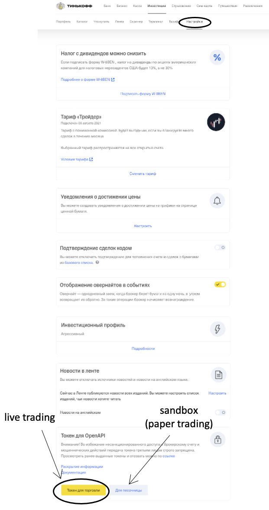
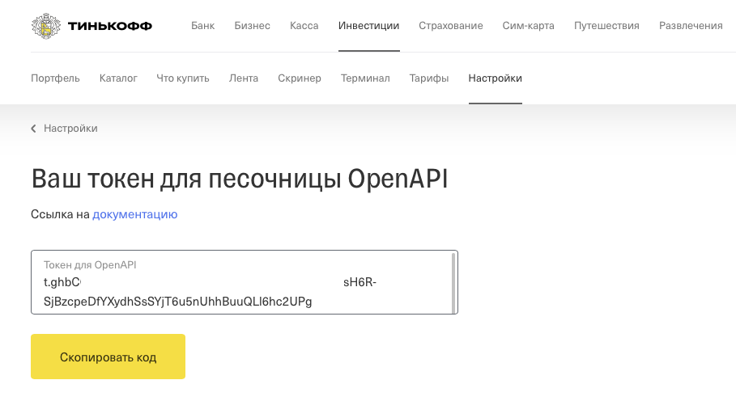

```{r, include = FALSE}
knitr::opts_chunk$set(
  collapse = TRUE,
  comment = "#>"
)
```

# Tinkoff Invest API

Для доступа к инвестиционному счету в Тинькофф Инвестиции существует
API с использованием, которого можно автоматизировать различные рутинные процессы.
В Tinkoff API реализовано 2 основных способа работы:

* Потоковый протокол -  ассинхронный вызов для загрузки рыночных данных в режиме реального времени

* протокол REST API построенный на основе http запросов, является одним из наиболее популярных методов построения API.

На текущий момент для использования доступна самая первая версия API, которая не поддерживает:

* фьючерсы, внебиржевые инструменты, торговлю бумагами Tinkoff

* заявки с условием (take-profit, stop-loss)

Полная документация относительно API Тинькофф Инвестиции доступна:
https://tinkoffcreditsystems.github.io/

## Библиотека tcsinvest

tcsinvest - это неофициальная библиотека R для работы с API Тинькофф Инвестиции. Библиотека дает доступ к функциональности API привычными функциями. Библиотека использует в своей основе библиотеку `data.table` как один из наиболее производительных способов работы с большими объемами информации в R.

В случае, если вы уже имеете токен и знаете как с ним работать - можно пропустить следующую главу ("Получение токена")

## Получение токена

Токен — это специальный набор символов, представляющий собой зашифрованную информацию о владельце, уровне прав доступа и прочей необходимой для авторизации в Tinkoff OpenAPI информации (из официальной документации).

А если коротко: токен - это та строчка, которая позволяет получить доступ к операциям со счета.

Существует 2 типа счета

* Торговый (живой) счет - это место где лежат ваши средства

* Песочница (sandbox, иногда paper trading) - это место где можно проверить функциональность API, запустить торговый алгоритм, без потерь реальных средств.

Мы настоятельно рекомендуем все проверки с программным кодом делать в песочнице. Все функции реализованные в библиотеке tcsinvest по умолчанию подключаются к песочнице (требуется специальное указание, что вы подключаетесь к торговому счету).

Получить токен можно из личного кабинета http://tinkoff.ru/invest/settings/. В разделе "Token для Open API" имеются 2 кнопки: для песочницы и для живой торговли.

```{r echo = FALSE, out.width = '100%'}

```

При нажатии одной из кнопок мы попадаем  на страницу где будет указан Ваш токен. Сохраните этот токен. Как гласит официальная документация "Токен отображается только один раз, просмотреть его позже не получится. Тем не менее вы можете выпускать неограниченное количество токенов". Ранее выпущенные токены можно отзывать, токены живут 3 месяца с момента их последнего использования.

P.S. важное замечание для торговли на живом счете функция "Подтверждение сделок кодом" должна быть отключена. 


```{r echo = FALSE, out.width = '100%'}

```

В случае, если вы уже установили библиотеку tcsinvest - можно пропустить следующую часть.

## Установка библиотеки tcsinvest

Для использования библиотеки в R, ее нужно сперва установить. Можно это сделать 2 способами:

* Использовать версию загруженную в репозиторий CRAN

* Использовать версию с Github

В репозиторий CRAN обычно загружены наиболее стабильные версии библиотек, их легко установить, но достаточно часто они не учитывают последние изменения в коде,  исправления возникающих ошибок и изменения в самом API. Хотя для большинства пользователей достаточно и рекомендуется использование библиотеки загруженной на CRAN. Для установки с CRAN достаточно найти библиотеку в списке общих пакетов или установить с использованием команды:
```{r eval = FALSE}
install.packages("tcsinvest")
```

В случае загрузки библиотеки с github необходима установленная библиотека `devtools` (в случае если ее нет - нужно установить).
```{r eval = FALSE}
devtools::install_github("arbuzovv/tcsinvest")
```
Иногда при таком методе возникает ошибка "Error in utils::download.file(url, path...." которая лечится следующей строчкой кода:
```{r eval = FALSE}
options(download.file.method = "libcurl")
```

В случае успешной загрузки и компиляции библиотеки, вам станет доступна библиотека tcsinvest в списке доступных библиотек. Теперь подключим данную библиотеку к пространству имен:
```{r }
library(tcsinvest)
```
Поздравляем! Вы стали на один шаг ближе к алготрейдингу. Теперь можно переходить к использованию функций библиотеки. В случае, если видите возникающие ошибки при подключения библиотеки - вернитесь на шаг назад и попробуйте установить библиотеку еще раз. 

# Получение списка доступных инструментов

К текущему шагу библиотека установлена и мы получили токен.
Запомним токен в нашем пространстве имен и помимо этого создадим объект live, который будет отвечать указывать работаем мы в песочнице или торгуем на реальном счете. По умолчанию во всех функциях установлено значение FALSE. 

```{r eval = FALSE}
token = 'my_token'
live = FALSE
```

Попробуем список вызвать список доступных акций:
```{r eval = FALSE}
getStocks(token,live)
```
Список доступных ETF:
```{r eval = FALSE}
getETFs(token,live)
```
Список доступных валют:
```{r eval = FALSE}
getCurrencies(token,live)
```
Список доступных облигаций:
```{r eval = FALSE}
getBonds(token,live)
```

При каждом вызове функции происходит 1 запрос. Необходимо помнить, что любое API имеет ограничение по списку запросов в промежуток времени. 
Для каждого запроса имеются свои ограничение пропускной способности (см. https://tinkoffcreditsystems.github.io/invest-openapi/rest/).

Крайне не рекомендуется пытаться проверять каое количество запросов на практике проходит до бана.

Иногда на практике необходимо выгрузить все доступные инструменты для торговли (иногда в алготрейдинге это называют universe). Для этого была написана функция, которая позволяется выполнить все 4 запроса одной командой:
```{r eval = FALSE}
universe = getUniverse(token,live)
```
Каждый вызов данной функции будет генерировать 4 запроса к серверу, поэтому рекомендуем не злоупотреблять количеством вызовов этой функции и просто сохранить ее в какую-либо переменную.

Данные функции возвращают объект `data.table` со следующим списком полей:

* `figi` - FIGI (англ.: Financial Instrument Global Identifier) — глобальный идентификатор финансового инструмента. Представляет собой 12-символьный код из латинских букв и цифр, определяется как идентификатор ценной бумаги на торговой площадке (бирже), которая является некоторым "источником цен".
Основным идентификаторов торгового инструмента при работе с OpenAPI является FIGI.

* `ticker` - краткое (1-5 букв) наименование ценной бумаге на конкретной бирже. 

* `isin` - ISIN (англ.: International Security Identification Number) — международный идентификационный номер ценной бумаги, состоит из 12 символов цифр и латинских букв, которые начинаются, как правило, с 2-буквенного кода страны эмитента ценной бумаги.

* `minPriceIncrement` - минимальный шаг цены (размер тика)

* `lot` - размер лота

* `currency` - валюта инструмента

* `name` - имя инструмента

* `type` - тип инструмента

* `faceValue` - номинальная стоимость (применим не для всех инструментов (применим не для всех инструментов))

* `minQuantity` - минимальный объем (применим не для всех инструментов)

Попробуем выбрать из списка информацию об акциях Сбербанка:
```{r eval = FALSE}
universe[ticker=='SBER']
```

Или достанем список доступных ОФЗ:
```{r eval = FALSE}
universe[substr(name,1,3)=="ОФЗ"]
```

Возможно, если вы работаете в RStudio, то более привычным будет искать данные, анализировать в окне просмотра `View`:
```{r eval = FALSE}
View(universe)
```
Иногда для того, чтобы не загружать всю информацию о всех инструментах - можно использовать специальные функции которые ищут по `figi` или по `ticker` информацию об инструменте:
```{r eval = FALSE}
getSymbolInfo(token,live,figi = 'BBG005HLTYH9')
getTickerInfo(token,live,'SBER')
```

# Получение рыночной информации

Рыночная информация - это основной ингридиент, который нужен в любой алгоритмической стратегии. В текущей версии API доступны только 3 типа информации: котировки, исторические данные и книга заявок. В последующих версия (выяснено в issues основного репозиротия API) возможно добавление фундаментальной информации, рыночного сантимента, наличия и условий шортов, информации о дивидендах и т.д.

## Котировки
Наиболее простой тип команды, который позволяет получить базовую информацию о текущем состоянии инструмента является команда `getQuotes`.
С помощью этой информации мы получаем основную информацию о котировках инструмента:
```{r eval = FALSE}
getQuotes(token,live,figi = 'BBG005HLTYH9')
```
Данные функции возвращают объект `data.table` со следующим списком полей:

* `figi` - внутренний код в Tinkoff API, именно с его использованием идентифицируются все инструменты и последующие команды в данном руководстве

* `tradeStatus` - статус торговли инструментом:
  - `break_in_trading` - торги приостановлены;
  - `normal_trading` - торги идут;
  - `not_available_for_trading` - торги не идут;
  - `closing_auction` - торги в аукционе закрытия;
  - `closing_period` - торги в периоде закрытия;
  - `discrete_auction` - торги в дискретном аукционе;
  - `opening_period` - торги в аукционе открытия;
  - `trading_at_closing_auction_price` - торги по цене аукциона закрытия

* `minPriceIncrement` - минимальный шаг цены

* `lastPrice` - последняя доступная цена сделки

* `closePrice` - цена закрытия предыдущего дня

* `limitUp` - верхнее ограничение по уровню цены заявки

* `limitDown` - нижнее ограничение по уровню цены заявки

* `best_bid_price` - лучшая цена покупки на рынке

* `best_bid_quantity` - объем лучшей цены покупки на рынке

* `best_ask_price` - лучшая цена продажи на рынке

* `best_ask_quantity` - объем лучшей цены продажи на рынке

## Исторические данные
Исторические данные - это наиболее используемый тип информации в любой алгоритмической системе. Для загрузки исторических данных по инструменту используется команда `getHistoricalData`, которая содержит в себе ряд важных параметров:

* `from` - с какой даты загружаем историю по инструменту (если дата будет слишком ранняя, это может вызывать отказ API выгружать слишком много инфомации)

* `to` - до какой даты загружаем историю по инструменту

* `interval` - какие бары выгружаем? минутные (`'1min'`,`'2min'`,`3min'`,`'15min'`,`'30min'`), часовые (`'hour'`,`'hour'`,`'2hour'`,`'4hour'`,), дневные (`'day'`), недельные(`'week'`), месячные (`'month'`)

Очень важным момент является соотношение выгружаемой истории с тем, какие бары выгружаются. У Tinkoff API имеются собственные ограничение на это. Выяснить их предлагается только опытным путем. 

```{r eval = FALSE}
getHistoricalData(token,live,figi = 'BBG005HLTYH9',from = Sys.Date() - 2,to = Sys.Date(),interval = "hour")
```


## Книга заявок
Наиболее полная информация о спросе и предложении на рынке содержится в книге заявок. Операция `getOrderBook` позволяет загружать такого рода информацию. Параметр `depth` отвечает за то, какое количество уровней в книге заявок загружать. В качестве результата данной функции выдается информации: цена,объем (заявки на продажу кодируются отрицательным объемом). Хотя в документации и описано, что глубина должна быть от 1 до 20, но на данный момент Тинькофф не отслеживает информацию по данному параметру и позволяет выгружать гораздо больше количество доступных уровней книги заявок.
```{r eval = FALSE}
getOrderBook(token,live,figi = 'BBG005HLTYH9',depth = 10)
```

# Взаимодействие со счетом
Предыдущая глава была посвящена взаимодействию с внешней информацией (или рыночной), но наиболее важным является взаимодействие с внутренней или торговым счетом.
В этой главе попробуем ответить на эти вопросы:

## Информация о счете
Как заявлено в официальной документации - на данный момент идет процесс разработки поддержки мультисчетов. Сейчас можно получить информацию о доступных на данный момент аккаунтах:
```{r eval = FALSE}
getAccounts(token,live)
```

Получить информацию о балансе аккаунта можно с помощью команды `getBalance`, которая выдает информацию о доступных средствах в 3 валютах (рубли, доллары и евро)
```{r eval = FALSE}
getBalance(token,live)
```

По каждому счету могут проходить достаточно большое количество различных (в том числе и неторговых операций). Ежемесячное снятие комиссии, комиссии за сделки, начисления дивидендов и т.д., все это достуно при помощи команды `getOperations`. Получить информацию о всех операциях совершенных на счету:
```{r eval = FALSE}
getOperations(token,live)
```

Для того, чтобы получить информацию о текущем портфеле используется команда `getPortfolio`:
```{r eval = FALSE}
getPortfolio(token,live)
```

Заявки на покупку или продажу инструментов могут иметь 3 статуса: отменена, исполнена, активна. По умолчанию API (и функция `getOrders`) возвращает только активные заявки.
В случае, если нам необходима история заявок необходимо указать `only_live_orders = FALSE` - вернется история за последние 5 дней. В случае необходимости более длительной истории - используйте параметры `from` и `to`.
```{r eval = FALSE}
getOrders(token,live,only_live_orders = F)
```

Для получения информации о сделка, используйте функцию `getTrades`. Контролировать глубину истории можно параметрами `from` и `to`. Параметр `symbol_info = TRUE` позволяет дополнительно подгрузить информацию об инструменте по которому была совершена сделка.
Получить информацию о сделках:
```{r eval = FALSE}
getTrades(token,live)
```

## Работа с заявками
Работа с заявками является важнейшей частью любого алгоритма. Глобально можно выделить 2 типа заявок: рыночные и лимитные.  В заявках указывается инструмент, объем (в лотах, а не в штуках!), направление и цена (только для лимитных заявок).
Поставить рыночную заявку
```{r eval = FALSE}
marketOrder(token,live,figi='BBG005HLTYH9',direction='Buy',lots=1)
```

Поставить лимитную заявку
```{r eval = FALSE}
limitOrder(token,live,figi='BBG005HLTYH9',direction='Buy',lots=1,price=1)
```

Результатом выполнения каждой команды является ответ системы о том, была ли поставлена заявка. Рекомендуется в своих алгоритмах использовать проверку на успешность выставленной заявки. Иногда требуется отмена выставленной заявки. Для этого используется функция `cancelOrder`. Для того, чтобы понять какую заявку нужно отменить, необходимо указать ее **orderId**, который можно найти с помощью функции `getOrders`.
```{r eval = FALSE}
cancelOrder(token,live,'orderId')
```

# Работа с потоковой информацией
Tinkoff API позволяет работать с потоковой информацией (через WebSocket). Особенностью работы с потокой информацией является ее асинхронность - информация с сервера приходит когда появились какие-то изменения. Очень важным моментом является факт того, что мы не знаем момента времени, когда придет следующее событие от сервера. Для взаимодействия с потоковой информацией необходимо писать обработчик событий. В API на данный момент поддерживаются 3 типа потоковых данных:

* `candle` - Подписка на свечи

* `orderbook` - Подписка на книгу заявок (стакан)

* `instrument_info` - Подписка на информацию об инструменте

На потоковые данные может как подписываться, так и отписываться от них.

Для работы с потоковыми данными необходимо создать объект клиент, который в последующем будет использован для создания подключения.

```{r eval = FALSE}
client = streamClient(token)
```
После создания клиента можно посмотреть статус этого клиента. Статус `Pre-connecting` означает, что подключение готово к использованию и можно подписываться на данные.
```{r eval = FALSE}
streamStatus(client)
```
Создадим подписку на данные об инструменте:
```{r eval = FALSE}
streamSubscribe(client,subscribe = TRUE,type='instrument_info',figi='BBG004730N88')
```
Для отмены подписки вызываем опять метод `streamSubscribe` c параметром `subscribe = FALSE`
```{r eval = FALSE}
streamSubscribe(client,subscribe = FALSE,type='instrument_info',figi='BBG004730N88')
```
Создадим подписку на данные о книге заявок:
```{r eval = FALSE}
streamSubscribe(client,subscribe = TRUE,type='orderbook',figi='BBG004730N88',depth=1)
```
Отменить подписку на данные о книге заявок:
```{r eval = FALSE}
streamSubscribe(client,subscribe = FALSE,type='orderbook',figi='BBG004730N88',depth=1)
```
Создадим подписку на цену:
```{r eval = FALSE}
streamSubscribe(client,subscribe = TRUE,type='candle',figi='BBG004730N88',interval='1min')
```
Отменить подписку на цену:
```{r eval = FALSE}
streamSubscribe(client,subscribe = FALSE,type='candle',figi='BBG004730N88',interval='1min')
```
Для того, чтобы разорвать соединение используйте функцию `streamClose`:
```{r eval = FALSE}
streamClose(client)
```

## Обработка событий
При подписки на данные включается обработчик событий, который по умолчанию является функцией `print` выводящей в консоль информацию о вновь поступившей рыночной информации. Для создания более сложной логики необходимо задать свой собственный обработчик событий. Для этой задачи обычно пишется пользовательская функция с необходимой логикой. В качестве примера попробуем написать обработчик событий, который по инфомации из книги заявок (`orderbook`) будет вычислять разницу между лучшей ценой спроса и предложения (бид-аск спред).
```{r eval = FALSE}
bid_ask_spread = function(x)
{
  spread = min(x$asks[,1])-max(x$bids[,1])
}
```
Теперь, когда у нас имеется пользовательская функция, можно приступить к обработке с ее помощью событий. Для этого в качестве агрумента `FUN` передадим название нашей новой функции `bid_ask_spread`:
```{r eval = FALSE}
streamSubscribe(client,subscribe = TRUE,type='orderbook',FUN = 'bid_ask_spread',figi='BBG004730N88',depth=5)
```
Для отмены подписки на данный поток, используйте команду с указанием той функции, с помощью которой подписывались на поток:
```{r eval = FALSE}
streamSubscribe(client,subscribe = FALSE,type='orderbook',FUN = 'bid_ask_spread',figi='BBG004730N88',depth=5)
```
В качестве функции обрабатывающей события может выступать любая логика, в том числе и торговая.

# Управление песочницей
Для отладки кода, лучше всего не рисковать своими деньгами и использовать специально созданную песочницу. В API присутствуют команды, которые позволяют управлять и настраивать песочницу. Стоит обратить внимание, что команды по регистрации новой песочницы и удалению старой проходят с определенным лагом.
Зарегистрировать счет:
```{r eval = FALSE}
sandboxRegister(token)
```
Удалить счет:
```{r eval = FALSE}
sandboxDeleteAccount(token)
```
Для того, чтобы торговать в песочнице, необходимо внести "песочных денег". Каждым выполнением команды `sandboxBalance` можно задавать необходимое количество валюты в песочнице:
```{r eval = FALSE}
sandboxBalance(token,balance = 10000,currency = 'USD')
```
Иногда необходимо работать с уже готовым портфелем на счету, поэтому имеется команда, которая позволяет задать количество определенного инструмента в портфеле. Каждый вызов функции представляет собой запись в портфель одной позиции:
```{r eval = FALSE}
sandboxPositions(token,balance = 100,figi = 'BBG000BMFNP4')
```
Для того, чтобы очистить портфель и обнулить баланс песочницы выполните команду `sandboxDeletePositions`
```{r eval = FALSE}
sandboxDeletePositions(token)
```

# P.S.
Данная документация не является полной и всеобъемлющей.  Это лишь небольшая попытка дать представление о первоначальных шагах работе с Tinkoff API. Библиотека `tcsinvest` является свободным ПО, создана энтузиастами и никак не связана с официальной командой разработки Тинькофф Инвестиции. Используя данную библиотеку вы берете на себя все риски связанные с потенциальными багами, ошибками и обработкой сообщений официального API. Вы всегда можете сообщить об ошибках возникающих в библиотеке `tcsinvest` в репозиторий на gihub: https://github.com/arbuzovv/tcsinvest/issues.
Stay tuned!
